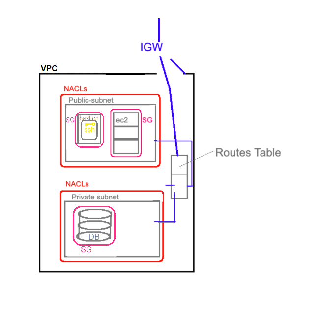
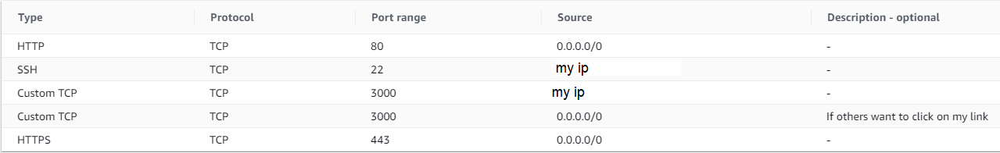

# AWS - Virtual Private Cloud
A VPC is a public cloud offering that lets an enterprise establish its own private cloud-like computing environment on shared public cloud infrastructure. A VPC gives an enterprise the ability to define and control a virtual network that is logically isolated from all other public cloud tenants, creating a private, secure place on the public cloud.

- This is a diagram to show how the VPC is set up with the routes table the ACL's and the Internet Gateway. It also shows the acceptance criteria for our app and DB instance.

## Instructions
Follow the instructions to set up your own VPC, with subnets to allow for a public and private environment to set up our app and db. By they end we should have a working app on the cloud, interacting with the database.

### VPC
- Create a VPC with appropriate IP address and CIDR block

### Internet Gateway
- Create an internet gateway that connects to your VPC

### Subnets
- Create two subnets for our vpc (A private and a public one)
- The CIDR block of each must be a larger number than the VPC (amounts for the number of hosts allowed)
- The base IP address must be the same as the VPC but each subnet needs to have a different bit value (must be a bit inside the Subnet CIDR block but outside the VPC CIDR block)

### Route table
- Two route tables must be created (A private and public one)
- Then edit routes
 - both must have access to the local and internet gateway we created on port 0.0.0.0/0

- Subnet association
  - associate each route with their corresponding subnet.

### Network ACL (Access Control List)
- we will need to create a seperate ACL for our public and private subnet
- Associate them with the corresponding subnet once created

- Once created we need to set inbound and outbound rules

- Repeat this process to create a private subnet ACL. (Keeping everything the same as public, untill we have got the app running, then change the permissions to:)
  - Allow it public subnet to ssh in
  - Allow the pub subnet to inbound in your db port 27017
  - Only allow the ephemeral ports open to your public subnet
  - Only allow any outbound traffic to http and https, dont allow any inbound http / https traffic.
  - Finally temporarily allow it to ssh in from our own IP, so we can set up the environment. Once complete we need to remove this setting.

## EC2 instance
- Set up an app and db EC2 instance, and refer to the [aws EC2 repo](https://github.com/samturton2/AWS-EC2server)
- on step 3 we want to specify our vpc and declare the relevant subnet

- create a Security group for each of the EC2 instances with the following settings.

- Once reviewed and launched, we can scp the relevant files into the VM's then ssh into our VM's running the provision files.
- Make sure the DB_HOST variable is changed to our public IP of the DB EC2 instance.

If all is running correctly the app should be running with the posts page having `npm start` in the app VM.

